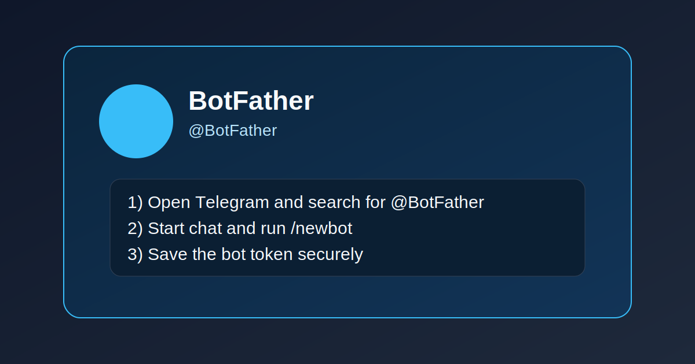
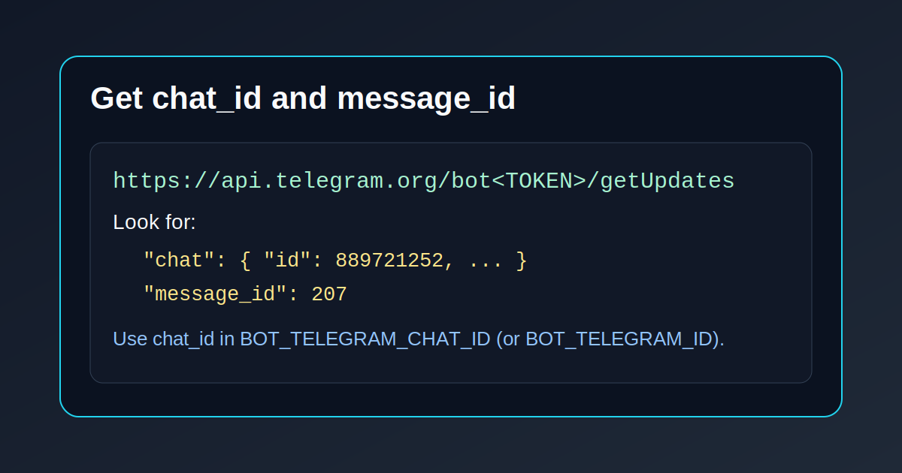

# 🤖 MCP Telegram Notify

Send Telegram notifications directly from any MCP-compatible AI agent.

This project is a **TypeScript MCP server** over `stdio`, designed to be easy to run locally and easy to distribute via **npm + npx**.

## ✨ Features

- ✅ Send a message to Telegram with one MCP tool call
- ✅ Validate Telegram config before sending anything
- ✅ Read recent Telegram updates to discover `chat_id` and `message_id`
- ✅ Works with `npx mcp-telegram-notify` in MCP config
- ✅ Token-first setup (safer than hardcoding full API URL)

## 📦 Installation

### Option A: Use directly with npx (recommended for MCP clients)

No local clone required in production:

```bash
npx -y mcp-telegram-notify
```

### Option B: Local development

```bash
npm install
npm run check
npm run build
npm run dev
```

## 🔧 Environment Variables

### Recommended (default behavior)

- `BOT_TELEGRAM_TOKEN` (required)
- `BOT_TELEGRAM_CHAT_ID` (required)

### Compatibility aliases

- `BOT_TELEGRAM_ID` (alias for chat ID)
- `BOT_TELEGRAM_URL` (legacy fallback, full sendMessage URL)

### Optional

- `BOT_TELEGRAM_TIMEOUT_MS` (default: `10000`)
- `BOT_TELEGRAM_THREAD_ID` (for Telegram forum topics)

> Security note: Prefer `BOT_TELEGRAM_TOKEN` over `BOT_TELEGRAM_URL` so your secret is managed as a single token value.

## 🧠 MCP Client Configuration

### npx setup (recommended)

```json
{
  "mcpServers": {
    "telegram-notify": {
      "command": "npx",
      "args": ["-y", "mcp-telegram-notify"],
      "env": {
        "BOT_TELEGRAM_TOKEN": "123456789:AAxxxxxxxxxxxxxxxxxxxxxxxxxxxx",
        "BOT_TELEGRAM_CHAT_ID": "889721252"
      }
    }
  }
}
```

### Local build setup

```json
{
  "mcpServers": {
    "telegram-notify": {
      "command": "node",
      "args": ["/ABSOLUTE/PATH/mcp_telegram_notify/dist/index.js"],
      "env": {
        "BOT_TELEGRAM_TOKEN": "123456789:AAxxxxxxxxxxxxxxxxxxxxxxxxxxxx",
        "BOT_TELEGRAM_CHAT_ID": "889721252"
      }
    }
  }
}
```

## 🛠️ Exposed MCP Tools

### `send_telegram_notification`

Send a message to your configured Telegram chat.

Input:
- `message` (string, required)
- `parseMode` (`HTML` | `Markdown` | `MarkdownV2`, optional)
- `disableNotification` (boolean, optional)

Output example:
- `Notification sent to Telegram (status 200, message_id=207).`

### `telegram_config_status`

Validate env config and show active source (`BOT_TELEGRAM_TOKEN` vs `BOT_TELEGRAM_URL`).

### `telegram_get_updates`

Fetch recent updates from Telegram to inspect:
- `chat_id`
- `message_id`
- message text
- username

Useful when you are still wiring your bot and need IDs.

## 📲 Telegram Bot Setup (BotFather)

### 1) Open BotFather

Search for **@BotFather** in Telegram and open it.



### 2) Create a new bot

Send:

```text
/newbot
```

Then follow prompts:
1. Bot display name (example: `My MCP Notifier`)
2. Bot username ending in `bot` (example: `my_mcp_notifier_bot`)

BotFather returns your token:

```text
123456789:AAxxxxxxxxxxxxxxxxxxxxxxxxxxxx
```

Save it securely as `BOT_TELEGRAM_TOKEN`.

### 3) Start a chat with your bot

Open your new bot and click **Start** (or send any message).

### 4) Get your `chat_id` and `message_id`

Call:

```bash
curl "https://api.telegram.org/bot<YOUR_TOKEN>/getUpdates"
```

Then look for:
- `message.chat.id` → this is your `chat_id`
- `message.message_id` → this is the message ID

Visual guide:



## 🧪 Quick Test

Use your real values:

```bash
curl -sS -X POST "https://api.telegram.org/bot<YOUR_TOKEN>/sendMessage" \
  -H "Content-Type: application/json" \
  -d '{"chat_id":"<YOUR_CHAT_ID>","text":"✅ MCP test message"}'
```

## 🚀 Publish to npm

1. Log in:

```bash
npm login
```

2. Validate and build:

```bash
npm run check
npm run build
```

3. Publish:

```bash
npm publish --access public
```

After publishing, users can run:

```bash
npx -y mcp-telegram-notify
```

## 🧩 GitHub Repository Setup

If this is a fresh local directory:

```bash
git init
git add .
git commit -m "Initial MCP telegram notify server"
git branch -M main
git remote add origin https://github.com/tecnomanu/mcp-telegram-notify-.git
git push -u origin main
```

## ⚠️ Troubleshooting

- `chat not found`:
  - Ensure you started chat with the bot first.
  - Re-check `BOT_TELEGRAM_CHAT_ID` from `getUpdates`.
- `401 Unauthorized`:
  - Token is invalid, regenerated, or malformed.
- No updates in `getUpdates`:
  - Send a message to your bot, then retry.

## 📄 License

MIT
